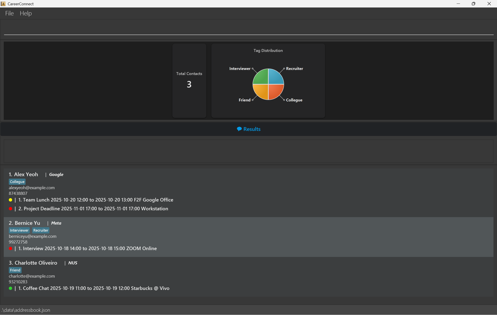
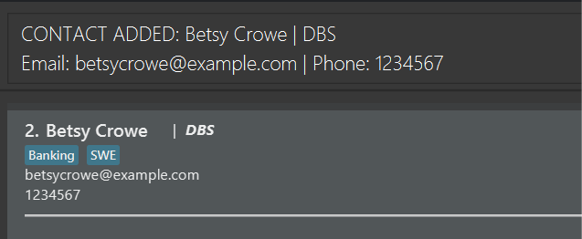
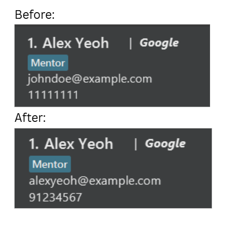
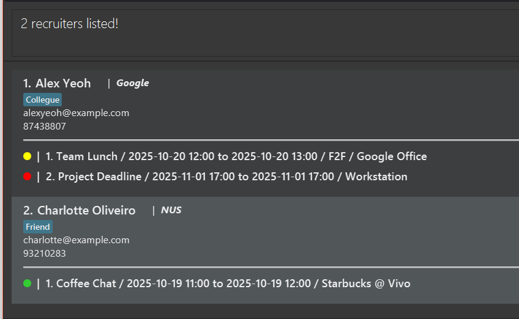
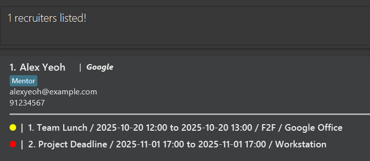
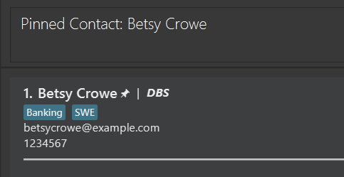
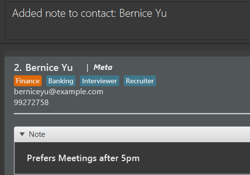

i---
layout: page
title: User Guide
---

**CareerConnect** is a desktop app designed for **university students** who regularly communicate with recruiters. It can help you **organise recruiter contacts efficiently**, so you can focus on building meaningful professional connections. If you can type fast, CareerConnect can get your contact management tasks done faster than traditional GUI apps.

## Table of Contents
- [Quick start](#quick-start)
- [Features](#features)
    - [Viewing help: `help`](#viewing-help--help)
    - [Adding a recruiter: `add`](#adding-a-recruiter-add)
    - [Adding a tag to a recruiter: `addtag`](#adding-a-tag-to-a-recruiter-addtag)
    - [Viewing all recruiters: `viewall`](#viewing-all-recruiters--viewall)
    - [Editing a recruiter: `edit`](#editing-a-recruiter--edit)
    - [Locating recruiters by name: `find`](#locating-recruiters-by-name-find)
    - [Finding recruiters by organisation: `findorg`](#finding-recruiters-by-organisation-findorg)
    - [Sorting contact list: `sort`](#sorting-contact-list-sort)
    - [Deleting a recruiter: `delete`](#deleting-a-recruiter--delete)
    - [Filtering recruiters by tag: `filtertag`](#filtering-recruiters-by-tag-filtertag)
    - [Pinning a recruiter: `pin`](#pinning-a-recruiter-pin)
    - [Unpinning a recruiter: `unpin`](#unpinning-a-recruiter-unpin)
    - [Adding an event: `event`](#adding-an-event-event)
    - [Deleting an event: `cancel`](#deleting-an-event-cancel)
    - [Getting reminders: `remind`](#getting-reminders-remind)
    - [Finding available time slots: `free`](#finding-available-time-slots-free)
    - [Attaching a note: `note`](#attaching-a-note-note)
    - [Clearing all entries: `clear`](#clearing-all-entries--clear)
    - [Exiting the program: `exit`](#exiting-the-program--exit)
    - [Saving the data](#saving-the-data)
    - [Editing the data file](#editing-the-data-file)
    - [Archiving data files `[coming in v2.0]`](#archiving-data-files-coming-in-v20)
- [FAQ](#faq)
- [Known issues](#known-issues)
- [Command summary](#command-summary)

--------------------------------------------------------------------------------------------------------------------

## Quick start

1. Ensure you have Java `17` or above installed in your Computer. 
   **Mac users:** Ensure you have the precise JDK version prescribed [here](https://se-education.org/guides/tutorials/javaInstallationMac.html).

1. Download the latest `.jar` file from [here](https://github.com/AY2526S1-CS2103T-T13-1/tp/releases).

1. Copy the file to the folder you want to use as the _home folder_ for CareerConnect.

1. Open a command terminal, `cd` into the folder you put the jar file in, and use the `java -jar CareerConnect.jar` command to run the application. 
   A GUI similar to the below should appear in a few seconds. Note how the app contains some sample data. 
   

1. Type the command in the command box and press Enter to execute it. e.g. typing **`help`** and pressing Enter will open the help window. 
   Some example commands you can try:

    * `viewall` : Lists all recruiters.

    * `add n/John Doe p/98765432 e/johnd@example.com o/NUS` : Adds a recruiter named `John Doe` to CareerConnect.

    * `delete 3` : Deletes the 3rd recruiter shown in the current list.

    * `clear` : Deletes all recruiters.

    * `exit` : Exits the app.

1. Refer to the [Features](#features) below for details of each command.

--------------------------------------------------------------------------------------------------------------------

## Features

**:information_source: Notes about the command format:** 

* Words in `UPPER_CASE` are the parameters to be supplied by the user. 
  e.g. in `add n/NAME`, `NAME` is a parameter which can be used as `add n/John Doe`.

* Items in square brackets are optional. 
  e.g `n/NAME [t/TAG]` can be used as `n/John Doe t/friend` or as `n/John Doe`.

* Items with `…`​ after them can be used multiple times including zero times. 
  e.g. `[t/TAG]…​` can be used as ` ` (i.e. 0 times), `t/friend`, `t/friend t/family` etc.

* Parameters can be in any order. 
  e.g. if the command specifies `n/NAME p/PHONE_NUMBER`, `p/PHONE_NUMBER n/NAME` is also acceptable.

* Extraneous parameters for commands that do not take in parameters (such as `help`, `viewall`, `exit` and `clear`) will be ignored. 
  e.g. if the command specifies `help 123`, it will be interpreted as `help`.

* If you are using a PDF version of this document, be careful when copying and pasting commands that span multiple lines as space characters surrounding line-breaks may be omitted when copied over to the application.

**:information_source: Notes about the common parameters:** 

* **NAME**  
    - Can only contain letters, numbers and these symbols: - _ . , ' ( )
    - Must not be blank.
    - Is **case sensitive** (e.g. Alex Yeoh and alex yeoh are unique names) 
      💡 Remember to capitalise your names to avoid confusion!
    - Example: `Alex Yeoh`, `Bernice Yu`

* **INDEX**  
    - Refers to the index number shown in the displayed list.  
    - Must be a positive integer (e.g. `1`, `2`, `3`, …).  
    - Example: `delete 2` deletes the 2nd person in the displayed list.

* **PHONE_NUMBER**  
    - Must contain only digits and must be at least 3 digits long.  
    - Must not contain spaces or other symbols.  
    - Example: `91234567`

* **EMAIL**
    - Consists of local-part@domain.
    - Local-part: Letters and numbers only, with optional special symbols: + _ . -
             Must not start or end with a special character.
    - Domain: Made of labels separated by .
      - Each label starts and ends with an alphanumeric character
      - may contain hyphens inside
      - the last label must be at least 2 characters long.
    - Example: `alexyeoh@example.com`

* **ORGANISATION**  
    - Must not be blank.  
    - Can take on any values.

* **TAG**  
    - Tag names are alphanumeric and cannot contain spaces.
    - Tags are **case sensitive** (e.g. friend and Friend are unique tags) 
      💡 Remember to capitalise your tags to avoid confusion! 
    - Tags are optional for most commands.  
    - Example: `t/Interviewer`, `t/Recruiter`

### Viewing help : `help`

Shows a message explaining how to access the help page.

Format: `help`

### Adding a recruiter: `add`

Adds a recruiter to CareerConnect.

Format: `add n/NAME p/PHONE_NUMBER e/EMAIL o/ORGANISATION [t/TAG]…`

:bulb: **Tip:**
A recruiter can have any number of tags (including 0)

:exclamation: **Note:**
You are not allowed to add a recruiter with the exact same name.

Examples:
* `add n/John Doe p/98765432 e/johnd@example.com o/Google`
* `add n/Betsy Crowe t/Banking e/betsycrowe@example.com o/DBS p/1234567 t/SWE`

### Adding a tag to a recruiter: `addtag`

Adds one or more tags to an existing recruiter contact without removing their current tags.

Format: `addtag INDEX TAG [MORE_TAGS]…`  
OR `addtag NAME TAG [MORE_TAGS]…`

* Adds the specified tag(s) to the recruiter identified by their `INDEX` or full `NAME`.
* Tags are **case sensitive**
* Tags that already exist will not be duplicated.
* The index refers to the number shown in the displayed recruiter list and must be a positive integer.

Examples:
* `addtag 2 Banking Finance` — adds the tags `Banking` and `Finance` to the 2nd recruiter in the list.

* `addtag Alex Yeoh SWE Mentor` — adds the tags `SWE` and `Mentor` to the recruiter named Alex Yeoh.

### Viewing all recruiters : `viewall`

Shows a list of all recruiters in CareerConnect and the total count.

Format: `viewall`

### Editing a recruiter : `edit`

Edits an existing recruiter in CareerConnect.

Format: `edit INDEX [n/NAME] [p/PHONE] [e/EMAIL] [o/ORGANISATION] [t/TAG]…`
OR `edit NAME [p/PHONE] [e/EMAIL] [o/ORGANISATION] [t/TAG]…`

* Edits the recruiter at the specified `INDEX` or with the specified `NAME`.
* At least one of the optional fields must be provided.
* Existing values will be updated to the input values.
* When editing tags, the existing tags of the recruiter will be removed (i.e., adding tags is not cumulative).
* You can remove all the recruiter's tags by typing `t/` without specifying any tags after it.

Examples:
* `edit 1 p/91234567 e/alexyeoh@example.com` Edits the phone number and email address of the 1st recruiter to be `91234567` and `alexyeoh@example.com` respectively. 

* `edit 2 n/Betsy Crower t/` Edits the name of the 2nd recruiter to be `Betsy Crower` and clears all existing tags.

### Locating recruiters by name: `find`

Finds recruiters whose names contain any of the given keywords.

Format: `find KEYWORD [MORE_KEYWORDS]`

* The search is case-insensitive. e.g `hans` will match `Hans`
* The order of the keywords does not matter. e.g. `Hans Bo` will match `Bo Hans`
* Only the name is searched.
* Only full words will be matched e.g. `Han` will not match `Hans`
* Recruiters matching at least one keyword will be returned (i.e. `OR` search).
  e.g. `Hans Bo` will return `Hans Gruber`, `Bo Yang`

Examples:
* `find John` returns `john` and `John Doe`
* `find alex charlotte` returns `Alex Yeoh`, `Charlotte Oliveiro` 

:exclamation: **Note:**
If there are no matches, CareerConnect will show you an empty list. Use `viewall` to show all recruiters again.

### Finding recruiters by organisation: `findorg`

Finds recruiters whose organisation names contain the specified keyword(s).

Format: `findorg KEYWORD [MORE_KEYWORDS]`

* The search is case-insensitive. e.g., `google` will match `Google` or `Google Singapore`.
* The order of the keywords does not matter.
* Only the organisation field is searched.
* Only full words will be matched e.g. `Google` will not match `Goo`
* Recruiters whose organisation name matches **any** of the provided keywords will be shown.

Examples:
* `findorg Google` — shows all recruiters from Google. 

* `findorg Meta Amazon` — shows recruiters from either Meta or Amazon.

### Sorting recruiters: `sort`

Sorts the displayed contact list based on the chosen criteria.

Format: `sort name` OR `sort timestamp`

* `name` sorts alphabetically by name.
* `timestamp` sorts by the time the person was added (oldest is first).

### Deleting a recruiter : `delete`

Deletes the specified recruiter from CareerConnect.

Format: `delete INDEX` OR `delete NAME`

* Deletes the recruiter at the specified `INDEX` or with the specified `NAME`.

Examples:
* `viewall` followed by `delete 2` deletes the 2nd recruiter in the address book.
* `delete Betsy Wong` directly deletes the contact with that name.

:bulb: **Tip:**
Use the `find` command before `delete` to ensure you're deleting the right recruiter.

### Filtering recruiters by tag: `filtertag`

Displays only the recruiters that contain the specified tag(s).

Format: `filtertag TAG [MORE_TAGS]…`

* Shows all recruiters who have **at least one** of the specified tags.
* The search is case-insensitive. e.g., `filtertag swe` will match recruiters tagged with `SWE`.
* You can provide multiple tags; the results will include any contact that matches **one or more** of them.

Examples:
* `filtertag Banking` — shows all recruiters with the tag `Banking`. 

* `filtertag SWE Product` — shows recruiters tagged with either `SWE` or `Product`.

### Pinning a recruiter: `pin`

Pins a recruiter contact to the top of the list (up to 3).

Format: `pin INDEX` OR `pin NAME`

* Pins the recruiter at the specified `INDEX` or with the specified `NAME`.
* Pinned contacts are identifiable by a 📌 icon.

Examples:
* `pin 4` 

* `pin James Lee`

:exclamation: **Note:**
Using `pin` will reset the list order. Apply `sort` to restore it according to your desired criteria.

### Unpinning a recruiter: `unpin`

Unpins a pinned recruiter contact.

Format: `unpin INDEX` or `unpin NAME`

* Unpins the pinned recruiter contact at the specified `INDEX` or with the specified `NAME`.

Example:
* `unpin 1`
* `unpin Alex Yeoh`

:exclamation: **Note:**
Using `unpin` will reset the list order. Apply `sort` to restore it according to your desired criteria.

### Adding an event: `event`

Adds an event to the specified recruiter.

Format: `event INDEX t/TITLE s/START e/END [m/MODE] [l/LOCATION]`

* The event is added to the recruiter at the specified `INDEX`.
* `START` and `END` should be specified in the `yyyy-MM-dd HH:mm` format.
* `MODE` can only be `F2F`, `ZOOM` or `CALL` (case-insensitive).

Examples:
* `event 2 t/Google Interview s/2025-10-21 14:00 e/2025-10-21 15:00 m/F2F l/Google Headquarters` 

* `event 2 t/Coffee Chat s/2025-10-21 11:00 e/2025-10-21 12:00`

### Deleting an event: `cancel`

Deletes a specified event from the specified recruiter.

Format: `cancel RECRUITER_INDEX EVENT_INDEX`

* The event at `EVENT_INDEX` is deleted from the recruiter at `RECRUITER_INDEX`.
* `RECRUITER_INDEX` refers to the index number shown in the displayed recruiter list.
* `EVENT_INDEX` refers to the index number shown in the displayed event list under a recruiter.
* Both `RECRUITER_INDEX` and `EVENT_INDEX` must be positive integers.

Example:
* `cancel 2 3` deletes the 3rd event under the 2nd recruiter.

### Getting reminders: `remind`

Displays a list of events happening today or tomorrow.

Format: `remind`

* Past events would not be shown.

### Finding available time slots: `free`

Displays a list of time slots not occupied by any events.

Format: `free h/NO_OF_HOURS d/DATE`

* `NO_OF_HOURS` should be an integer in the range [1, 16].
* `DATE` should be specified in the `yyyy-MM-dd` format.
* The earliest start time that can be suggested is 07:00 while the latest end time is 23:00.
* The time slots are checked for their availability in 15-minute intervals.

Example: 
* `free h/2 d/2025-10-10`

### Attaching a note: `note`

Attaches a note to the specified recruiter.

Format: `note INDEX no/NOTE_CONTENT`

* The note is added to the recruiter at the specified `INDEX`.
* `NOTE_CONTENT` takes in any string (ℹ️ empty string will remove the note).
* To delete a note, simply type `note INDEX`.

Examples:
* `note 2 no/Prefers Meetings after 5pm` 

* `note 2` (To delete)

### Clearing all entries : `clear`

Clears all entries in CareerConnect.

Format: `clear`

### Exiting the program : `exit`

Exits the program.

Format: `exit`

### Saving the data

CareerConnect data are saved in the hard disk automatically after any command that changes the data. There is no need to save manually.

### Editing the data file

CareerConnect data are saved automatically as a JSON file `[JAR file location]/data/addressbook.json`. Advanced users are welcome to update data directly by editing that data file.

:exclamation: **Caution:**
If your changes to the data file makes its format invalid, CareerConnect will discard all data and start with an empty data file at the next run. Hence, it is recommended to take a backup of the file before editing it. 
Furthermore, certain edits can cause CareerConnect to behave in unexpected ways (e.g., if a value entered is outside of the acceptable range). Therefore, edit the data file only if you are confident that you can update it correctly.

### Archiving data files `[coming in v2.0]`

_Details coming soon ..._

--------------------------------------------------------------------------------------------------------------------

## FAQ

**Q**: How do I transfer my data to another Computer? 
**A**: Install the app in the other computer and overwrite the empty data file it creates with the file that contains the data of your previous CareerConnect home folder.

**Q**: I edited the data file and now something is wrong with the application. What do I do? 
**A**: To reset the application, go to the folder containing the jar file and find the data subfolder. From there, delete the file addressbook.json and re-open the application. Unfortunately, any existing data will be gone.

**Q**: Can I use non-English names or tags? 
**A**: No, currently only English letters, numbers, and certain special characters are supported. Non-English characters (e.g., Chinese, Arabic, accented letters) are not allowed.

**Q**: Why does sorting names sometimes seem unpredictable when they contain numbers or special characters?
**A**: The sort name order is based on the ASCII values of characters. As a result, names with numbers or special characters may not appear in strict alphabetical order.

--------------------------------------------------------------------------------------------------------------------

## Known issues

1. **When using multiple screens**, if you move the application to a secondary screen, and later switch to using only the primary screen, the GUI will open off-screen. The remedy is to delete the `preferences.json` file created by the application before running the application again.
2. **If you minimize the Help Window** and then run the `help` command (or use the `Help` menu, or the keyboard shortcut `F1`) again, the original Help Window will remain minimized, and no new Help Window will appear. The remedy is to manually restore the minimized Help Window.

--------------------------------------------------------------------------------------------------------------------

## Command summary

Action | Format, Examples
--------|------------------
**Viewall** | `viewall`
**Help** | `help`
**Add** | `add n/NAME p/PHONE_NUMBER e/EMAIL o/ORGANISATION [t/TAG]…`   e.g., `add n/James Ho p/22224444 e/jamesho@example.com o/NUS t/SWE`
**Clear** | `clear`
**Delete** | `delete INDEX` OR `delete NAME`  e.g., `delete 3`   e.g., `delete James Ho`
**Edit** | `edit INDEX [n/NAME] [p/PHONE] [e/EMAIL] [o/ORGANISATION] [t/TAG]…` OR   `edit NAME [p/PHONE] [e/EMAIL] [o/ORGANISATION] [t/TAG]…`   e.g., `edit 2 n/James Lee e/jameslee@example.com`   e.g., `edit James Lee e/jameslee@example.com`
**Find** | `find KEYWORD [MORE_KEYWORDS]`  e.g., `find James Jake`
**Findorg** | `findorg KEYWORD [MORE_KEYWORDS]`   e.g. `findorg Google`
**Pin** | `pin INDEX` OR `pin NAME`  e.g., `pin 3`   e.g. `pin Jake Thomas`
**Unpin** | `unpin INDEX` OR `unpin NAME`  e.g., `unpin 3`   e.g. `unpin Alex Yeoh`
**Addtag** | `addtag INDEX TAG [MORE_TAGS]...` OR `addtag NAME TAG [MORE_TAGS]…`   e.g. `addtag 2 Banking Finance`
**Filtertag** | `filtertag TAG [MORE_TAGS]…`   e.g. `filtertag Banking`
**Sort** | `sort name` OR `sort timestamp`
**Event** | `event INDEX t/TITLE s/START e/END [m/MODE] [l/LOCATION]`   e.g., `event 2 t/Google Interview s/2025-10-21 14:00 e/2025-10-21 15:00 m/F2F l/Google Headquarters`
**Cancel** | `cancel RECRUITER_INDEX EVENT_INDEX`   e.g. `cancel 2 3`
**Remind** | `remind`
**Free** | `free h/NO_OF_HOURS d/DATE`   e.g. `free h/2 d/2025-10-10`
**Note** | `note RECRUITER_INDEX no/NOTE_CONTENT`   e.g. `note 2 no/Prefers Meetings after 5pm`
